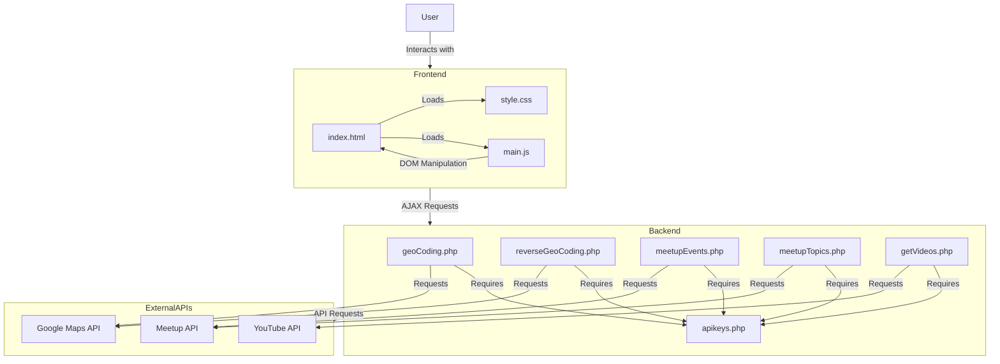
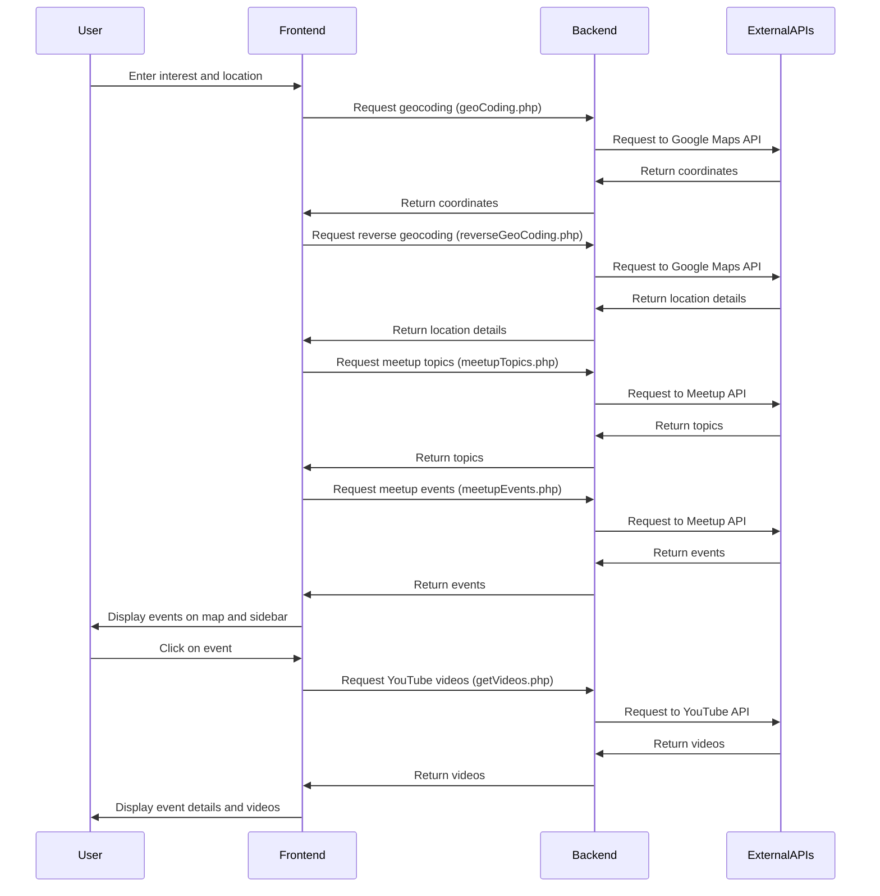
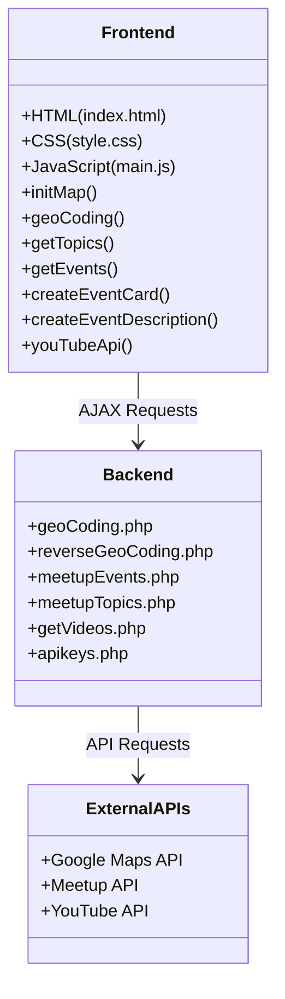

# Meetup Map Architecture

This document provides a visual representation of the Meetup Map application architecture and data flow.

## Application Architecture



## User Flow



## Component Structure



## Data Flow

```mermaid
flowchart TD
    A[User Input] --> B[Geocoding]
    B --> C[Get Meetup Topics]
    C --> D[Get Meetup Events]
    D --> E[Parse Events for Maps]
    E --> F[Initialize Map]
    F --> G[Create Event Cards]
    
    H[User Clicks Event] --> I[Display Event Details]
    H --> J[Get YouTube Videos]
    J --> K[Display Videos]
    
    L[User Clicks Map Marker] --> M[Show Info Bubble]
    M --> N[Highlight Corresponding Card]